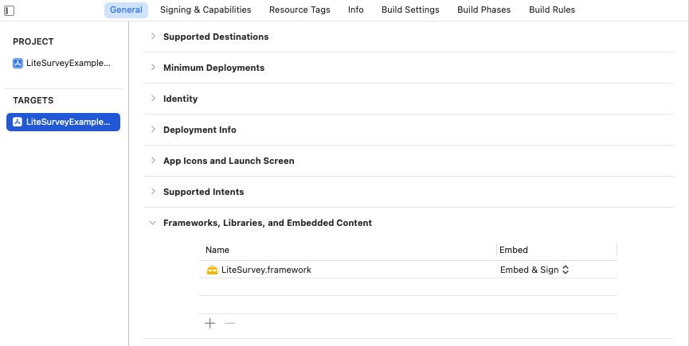
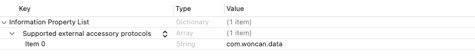
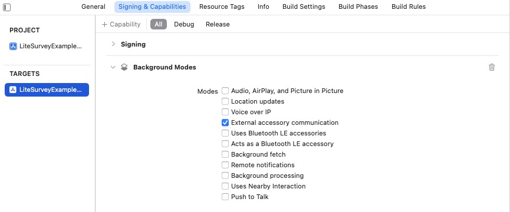

# LiteSurvey SDK Demo for iOS

This demo project shows how to use the LiteSurvey SDK to connect to Woncan LiteSurvey devices.

LiteSurvey SDK for iOS can connect to LiteSurvey devices and

- Output device data (location, satellite, etc.) to the application
- Configure device settings
- Perform device firmware upgrade
- and more

By integrating this SDK, you can support LiteSurvey device's high-accuracy position in your own app.

This SDK is also used in Woncan's official iOS app, LiteGPS.

## iOS system requirement

iOS 13.0 or above is required.

## How to use the SDK in your own app

### 1. Adding LiteSurvey as a dependency

**Method 1: CocoaPods (preferred)**

[CocoaPods](http://cocoapods.org) is a dependency manager for Cocoa projects. You can install it with the following command:

```bash
$ gem install cocoapods
```

To integrate LiteSurvey into your Xcode project using CocoaPods, specify it in your `Podfile`:

```ruby
source 'https://github.com/CocoaPods/Specs.git'
platform :ios, '13.0'
use_frameworks!

target '<Your Target Name>' do
    pod 'LiteSurvey', '~> 0.0.1'
end
```

Then, run the following command:

```bash
$ pod install
```

**Method 2: Manual integration**

If you prefer not to use Cocoapods, you can integrate LiteSurvey into your project manually. The SDK framework file is available under "Releases".

You will need to Embed & Sign the LiteSurvey.framework file:



### 2. Configure info.plist

Add "com.woncan.data" as a supported external accessory protocol:



If device connection in background mode is desired, you may optionally add the "External accessory communication" Background mode under "Signing and Capabilities".



### 3. Import the Objective-C header

LiteSurvey SDK is written in Objective-C. Add `#import <LiteSurvey/LiteSurvey.h>` to your Objective-C source file to start using the SDK. For applications developed in Swift, a bridging header is required.

### 4. Scanning for devices

Use the `LiteSurveyDeviceInterface.startScan` method to start scanning.

### 5. Receive device data (e.g. location)

While initializing `LiteSurveyDeviceInterface`, register a delegate implementing the `LiteSurveyDeviceDelegate` interface to receive device data.

### Code example

The following code snippet is a minimal code example in Swift that

1. Scans for and connect to LiteSurvey devices.
2. Prints the location information reported by the device to debug output.

```Swift
class ViewController: UIViewController,LiteSurveyDeviceDelegate {
  var liteSurveyInterface: LiteSurveyDeviceInterface?
  override func viewDidLoad() {
        super.viewDidLoad()
        liteSurveyInterface = LiteSurveyDeviceInterface(delegate: self)
  }

    //Scanning for LiteSurvey devices
    public func toSearch() {
        liteSurveyInterface?.startScan()
    }

    // Receive Location delegate
    func didReceiveLocation(_ location: LiteSurveyLocationModel!) {
        print(location!)
    }
}
```

## Location information reported by the SDK

Location information is reported as the `LiteSurveyLocationModel` class. This class inherits from the system Location class [ `CLLocation`](https://developer.apple.com/documentation/corelocation/cllocation?language=objc#). Please see `LiteSurveyLocationModel` class definition for details.

Table: LiteSurvey SDK support for system `CLLocation` class parameters

|      Parameter      | Supported by LiteSurvey | Note                                          |
| :-----------------: | ----------------------- | --------------------------------------------- |
|     coordinate      | Yes                     |                                               |
|      altitude       | Yes                     |                                               |
| ellipsoidalAltitude | No                      | Use the custom property wgs84Altitude instead |
| horizontalAccuracy  | Yes                     |                                               |
|  verticalAccuracy   | Yes                     |                                               |
|       course        | Yes                     |                                               |
|   courseAccuracy    | No                      |                                               |
|        speed        | Yes                     |                                               |
|    speedAccuracy    | No                      |                                               |
|      timestamp      | Yes                     |                                               |
|        floor        | No                      |                                               |
|  sourceInformation  | Yes                     |                                               |

## Contact email

For technical or business inquiries, please contact support@woncan.com.hk
